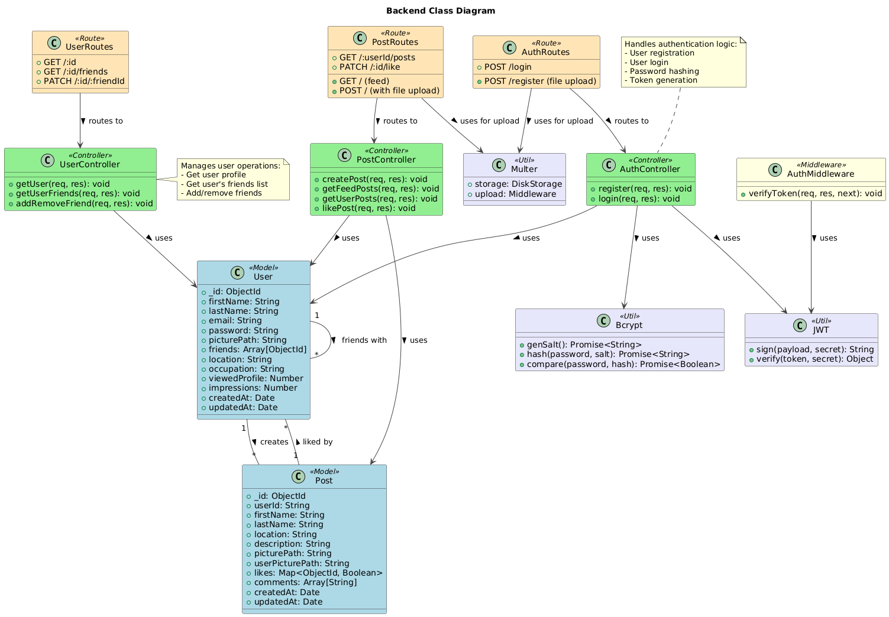
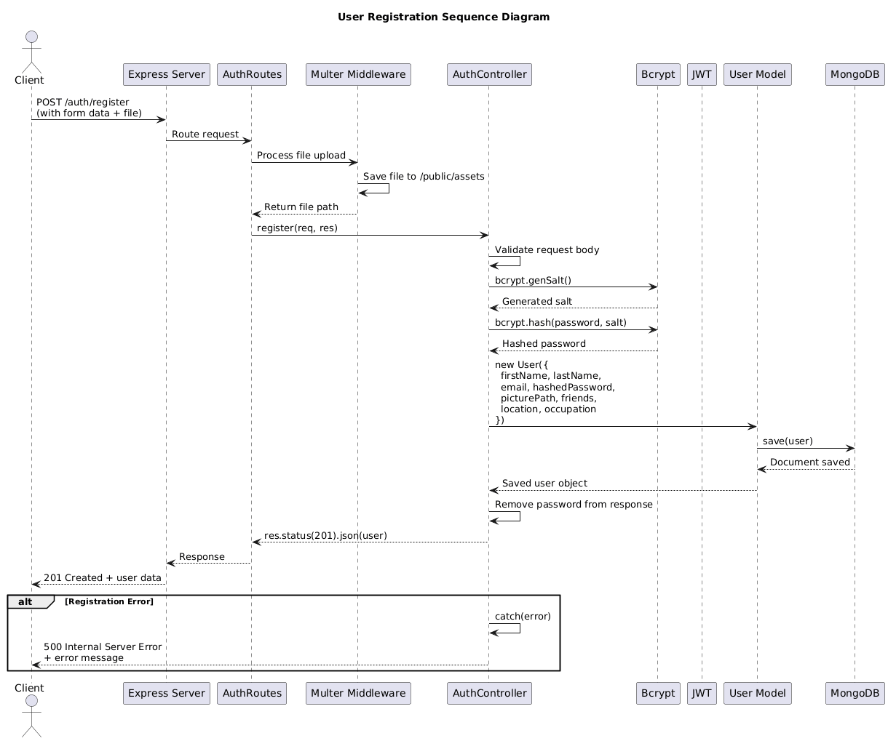
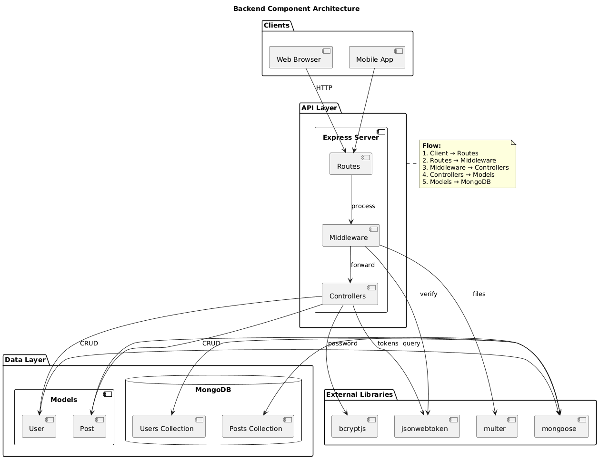

# MERN Social Network

**Fullstack Social Netwoking Service** - A full-featured app built with the MERN stack (MongoDB, Express, React, Node). The app is responsive, supports light/dark themes, and implements full user functionality: authentication, profiles, posts, comments, likes, following, notifications, and media uploads.

---

## Table of Contents

* [Project Overview](#project-overview)
* [Features](#features)
* [Tech Stack](#tech-stack)
* [Architecture & Database](#architecture--database)
* [Getting Started](#getting-started)

  * [Prerequisites](#prerequisites)
  * [Environment Variables](#environment-variables)
  * [Install](#install)
  * [Run (Development)](#run-development)
  * [Build & Run (Production)](#build--run-production)
* [API Overview](#api-overview)
* [Frontend Notes](#frontend-notes)
* [Folder Structure](#folder-structure)
* [Testing](#testing)
* [Deployment](#deployment)
* [Contributing & Grading Notes](#contributing--grading-notes)
* [License](#license)
* [Contact](#contact)

---

## Project Overview

This project is a social networking web application implementing typical social features (user registration and profiles, feed, posting, commenting, likes, following, and notifications). The focus for the semester project includes:

* Clean, modular MERN architecture
* Responsive and accessible UI
* Persistent storage with MongoDB (schema design and relations)
* Authentication and authorization
* File uploads for avatars and post media
* Theme support (dark / light)

## Features

* User sign-up / sign-in (JWT + refresh token pattern)
* Profile creation and edit
* Create, edit, delete posts
* Like / unlike posts
* Comment on posts
* Follow / unfollow users
* Search for users and posts
* Settings: privacy, theme (dark/light)
* Responsive design and accessibility considerations

## Tech Stack

* **Frontend:** React (TypeScript optional), React Router
* **Backend:** Node.js, Express
* **Database:** MongoDB (Mongoose ODM)
* **File uploads:** multer (server) + static hosting for `/public/assets`
* **Auth:** JWT (access & refresh tokens), bcrypt for password hashing
* **Dev tools:** nodemon, eslint, prettier
* **Styling:** CSS Modules / Tailwind CSS

## Architecture & Database

* Single RESTful API served by Express
* MongoDB models: `User`, `Post`, `Comment`, `Follow`, `Notification`
* Class Diagram:
   
* Sequence Diagram
  
* Component Diagram
  

## Getting Started

### Prerequisites

* Node.js v18+ (or latest LTS)
* npm
* MongoDB instance

### Environment Variables

Create a `.env` file in the `server` folder with at least the following variables:

```
PORT=3001
MONGO_URL=mongodb+srv://<user>:<password>@cluster0.mongodb.net/mern-social?retryWrites=true&
```

> **Never commit `.env` to version control.** Add it to `.gitignore`.

### Install

From repository root:

```bash
# Install server deps
cd server
npm install
```

### Run (Development)

Server (with ES modules configured via `package.json: { "type": "module" }`):

```bash
# from server/
npx nodemon index.js
```

Client (React):

```bash
# from client/
npm start
```

### Build & Run (Production)

```bash
# build client
cd client
npm run build

# start server
cd ../server
npm start
```

## API Overview

in progress

## Frontend Notes

* Use a global theme context (or CSS variables) to implement dark / light mode toggling and persistence (e.g. `localStorage` or user profile setting).
* Implement responsive breakpoints (mobile, tablet, desktop) and test on multiple sizes.
* Lazy-load images and code-split heavy routes to improve performance.

## Folder Structure

in progress

```
/fullstack-mern-app
├─ server/
│  ├─ index.js
│  ├─ package.json
└─ README.md
```

## Testing

* Add unit tests for critical backend logic (auth, permissions).
* Add integration tests for API endpoints.
* For frontend, write a few smoke tests (react-testing-library) for key flows: login, posting, feed display.

## Deployment

in progress

## Contributing & Grading Notes

* Document implemented features and which requirements from the assignment are met.
* Include a short demo video or screenshots with annotations.
* Provide instructions to run the app locally and how to seed the database.

## License

This project is created for an academic semester assignment.

## Contact

Author: Olha Shtyfliuk - `shtyfliuko@gmail.com`

---

*Last updated: 19-11-2025*
